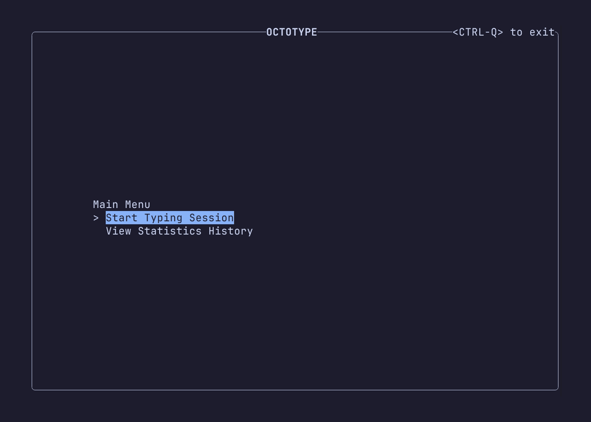

> The above mascot is Squibbles (Scribbles) - He is generated by ChatGPT. If
> anyone wants to create a proper mascot, feel free to submit an issue 😄

<div align="center">

[](https://ratatui.rs/)
[![Crate Badge]][Crate]

</div>

OctoType is a TUI typing trainer made with [Ratatui], and powered by [Gladius] -
Heavily inspired by [Monkeytype], with a focus on customizability



> [!WARNING]
>
> This is still a **work in progress**. Breaking changes to Modes, Sources and
> the configuration might occur.

## 💡 Features

- 🎭 Custom [Modes](https://github.com/mahlquistj/octotype/wiki/Modes)
- 🖊️ Custom [Sources](https://github.com/mahlquistj/octotype/wiki/Sources)
- 🎨 Custom theming
- 📈 Pretty graphs
- 🪶 Lightweight (~2MB)
- 🔥 Blazingly fast (Sorry, i had to.. 🦀)
- .. And more to come!

## 🔽 Installation

Installation can currently be done by using `cargo install octotype`

### Nix

You can add OctoType as a Flake:

```nix
{
  inputs = {
    nixpkgs.url = "github:nixos/nixpkgs/nixos-unstable";
    octotype.url = "github:mahlquistj/octotype/main";
  };
  
  outputs = { self, nixpkgs, rio }: {
    nixosConfigurations.hostname = nixpkgs.lib.nixosSystem {
      modules = [
        ({ pkgs, ... }: {
          environment.systemPackages = [
            octotype.packages.${pkgs.system}.octotype
          ];
        })
      ];
    };
  };
}
```

No package exists in nixpkgs _yet_.

## 🔖 Arguments

| Short       | Long               | Description                                    |
| ----------- | ------------------ | ---------------------------------------------- |
|             | `--print-config`   | Prints the current settings, modes, and source |
| `-p`        | `--print-settings` | Prints the current settings                    |
| `-c <path>` | `--config <path>`  | Overrides the default config location          |
| `-h`        | `--help`           | Shows a help page with the list of arguments   |

## ⚙️ Configuration

Check out the [Wiki] for configuration options.

## 💻 Development

A nix flake dev-shell is provided to run with `nix-develop`.

## ⭐ Contributing

If you have an idea, bug-report or alike, feel free to open an issue or a PR -
It's more than welcome!

I'm only developing this in my spare time, so don't expect immidiate replies 😄

## ❓ Why another typing-trainer?

It all started as a fun side-project to learn typing on my new [ZSA Moonlander]
keyboard. I was inspired by using [Monkeytype] a lot, but found that i was
missing more customizability when it came to what modes and words i could get.

<!-- LINKS -->

[Monkeytype]: https://monkeytype.com/
[Ratatui]: https://ratatui.rs/
[Wiki]: https://mahlquistj.github.io/octotype/
[ZSA Moonlander]: https://www.zsa.io/moonlander
[Gladius]: https://github.com/mahlquistj/gladius
[Crate]: https://crates.io/crates/octotype
[Crate Badge]: https://img.shields.io/crates/v/octotype

