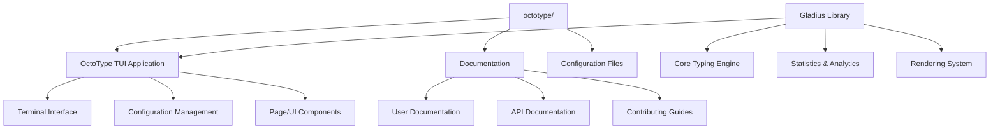
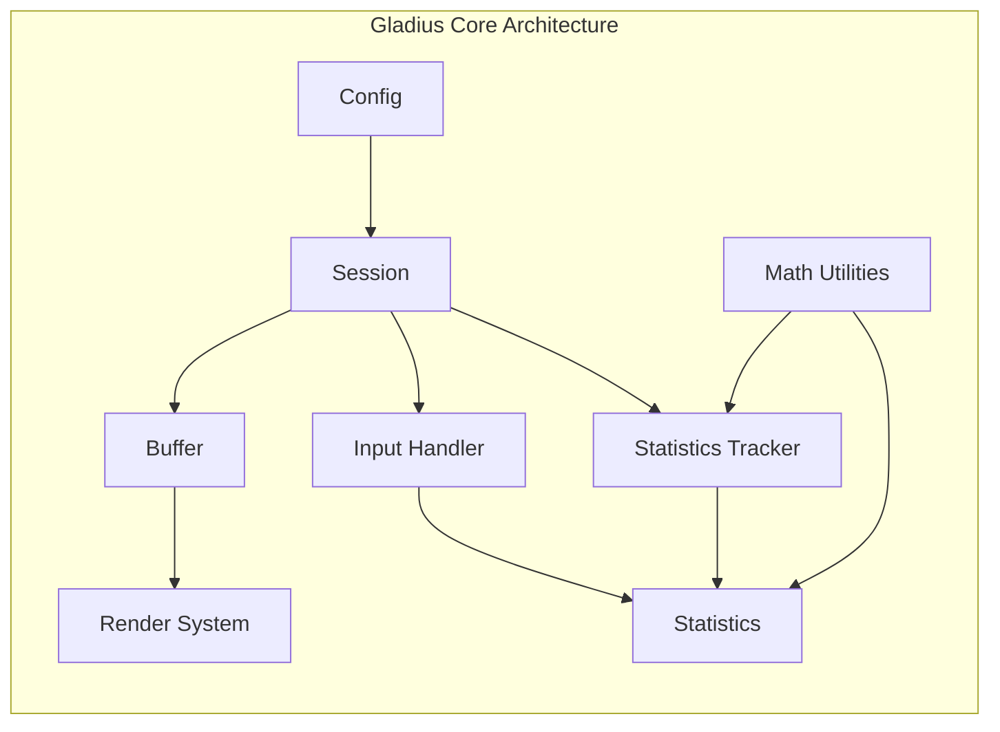
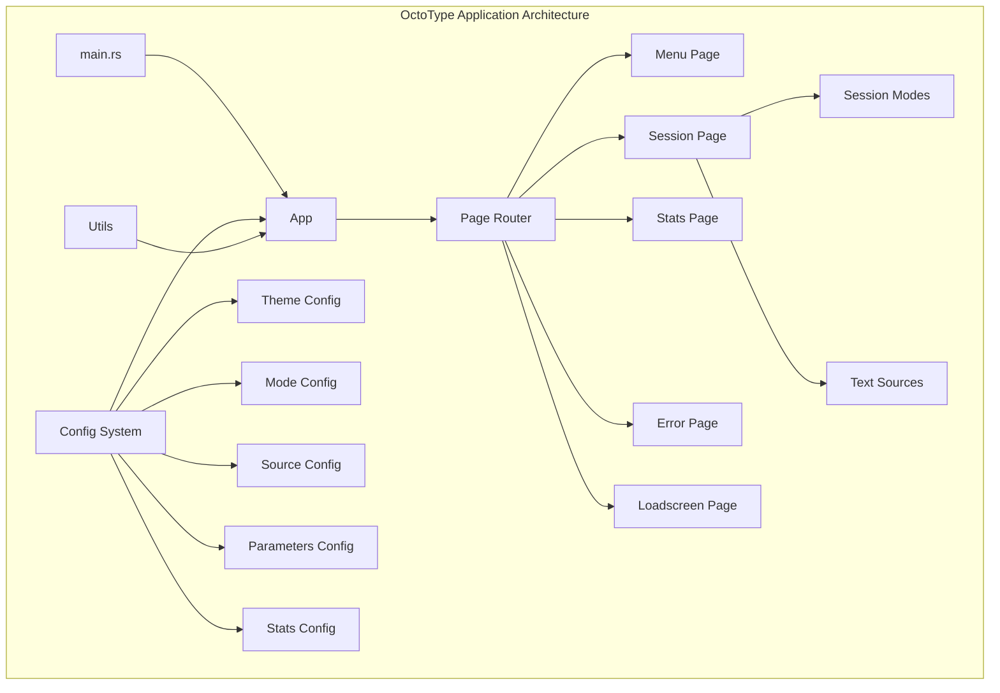
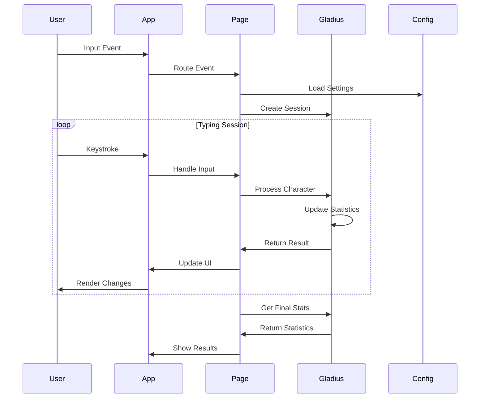
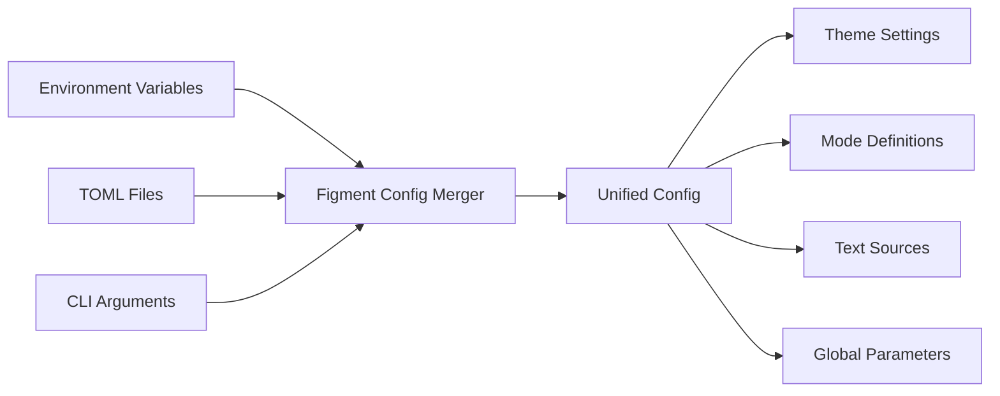
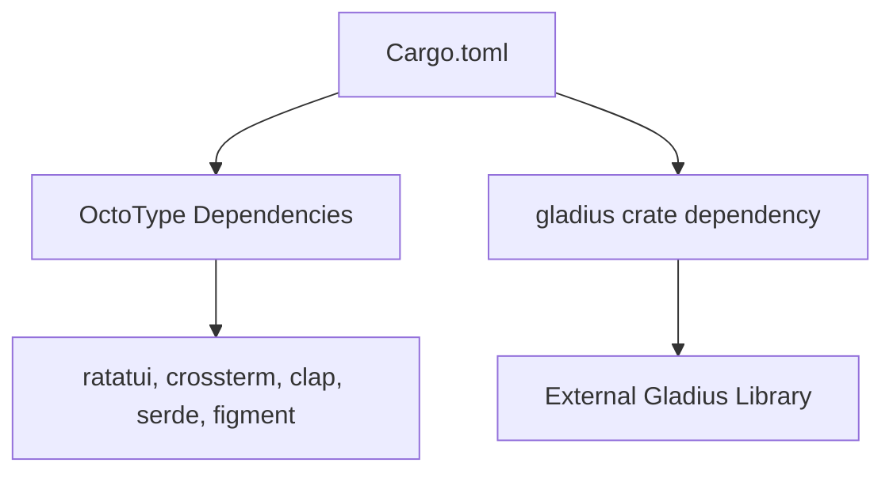

# OctoType Project Structure

This guide provides a comprehensive overview of the OctoType project
architecture for contributors. The project is a terminal user interface
application built on top of the [Gladius](https://github.com/mahlquistj/gladius)
typing engine library.

## Repository Overview

OctoType is a Rust application that uses the external [Gladius](https://github.com/mahlquistj/gladius) library:



## Core Components

### 1. Gladius Library (External Dependency)

[Gladius](https://github.com/mahlquistj/gladius) is the high-performance typing
trainer library that provides the core functionality for any typing trainer
application. This is an external dependency maintained in its own repository.



**Key modules:**

- `session.rs` - Main typing session orchestration
- `buffer.rs` - Text buffer and character state management
- `input_handler.rs` - User input processing and validation
- `statistics_tracker.rs` - Real-time performance metrics
- `statistics.rs` - Data structures for typing statistics
- `render.rs` - Generic rendering interface
- `math.rs` - Mathematical utilities and algorithms
- `config.rs` - Library configuration

**Performance Features:**

- O(1) keystroke handling
- Efficient character-to-word mapping
- Welford's algorithm for numerical stability
- Minimal memory allocations during typing

### 2. OctoType Application

The terminal-based typing trainer application built on top of Gladius.



**Key modules:**

#### Application Core

- `main.rs` - Entry point and CLI argument parsing
- `app.rs` - Main application loop and event handling
- `page.rs` - Page routing and state management
- `utils.rs` - Utility functions and constants

#### Configuration System (`config/`)

- `config.rs` - Main configuration orchestration
- `theme.rs` - Color themes and visual styling
- `mode.rs` - Typing modes (time-based, word-based, etc.)
- `source.rs` - Text sources configuration
- `parameters.rs` - Session parameters and settings
- `stats.rs` - Statistics display configuration

#### Page System (`page/`)

- `menu.rs` - Main menu interface
- `session.rs` - Active typing session interface
- `stats.rs` - Performance statistics display
- `error.rs` - Error handling and display
- `loadscreen.rs` - Loading states and transitions

#### Session Components (`page/session/`)

- `mode.rs` - Session mode implementations
- `text.rs` - Text processing and management

## Data Flow



## Configuration Architecture

The configuration system supports multiple file formats and sources:



Configuration files are typically located in:

- `~/.config/octotype/` (Linux/macOS)
- `%APPDATA%/octotype/` (Windows)

## Build System

The project uses Cargo for dependency management:



**Key Build Features:**

- Optimized release builds with LTO and strip
- External gladius library dependency
- Clippy linting with strict rules

## Documentation System

Documentation is built using Docusaurus and includes:

```
docs/
├── docs/
│   ├── configuration/          # User configuration guides
│   └── contributing/           # Contributor documentation
│       └── development/        # Development guides
├── src/                        # Docusaurus source
└── docusaurus.config.ts        # Docusaurus configuration
```

## Performance Considerations

- **Gladius** prioritizes performance for real-time typing analysis
- **OctoType** balances performance with user experience
- Critical paths are optimized for minimal latency
- Statistics calculations use numerically stable algorithms
- Memory allocations are minimized during active typing

This architecture enables both standalone library usage and a complete typing
trainer application while maintaining clear separation of concerns and high
performance.
