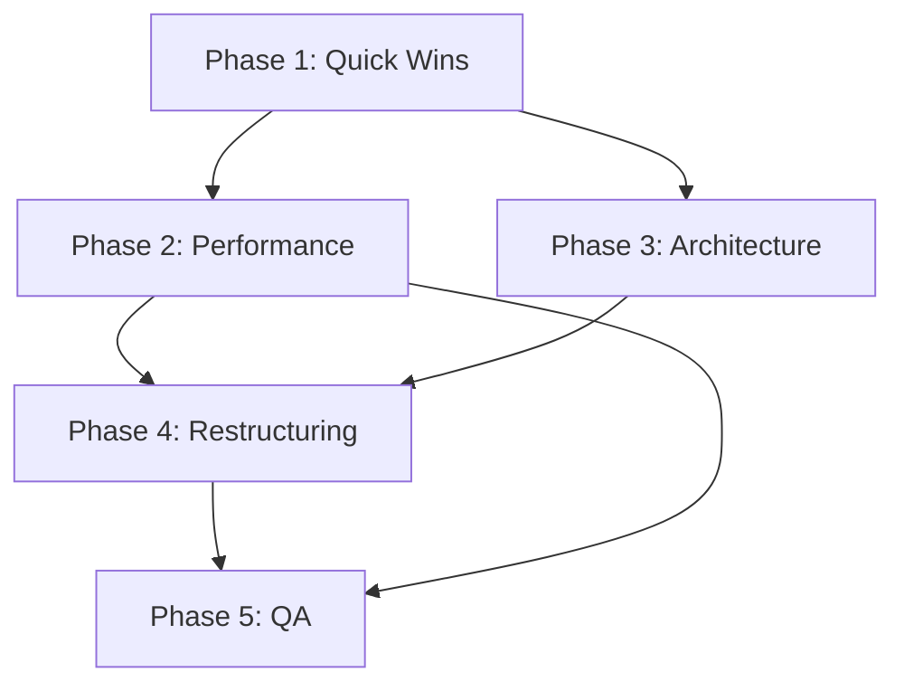

# Gladius Refactoring Implementation Phases

This document breaks down the refactoring work identified in
`REFACTORING_ANALYSIS.md` into manageable phases that can be implemented
incrementally without breaking existing functionality.

## Phase 1: Quick Wins (1-2 days)

_Low risk, high impact improvements that don't change public APIs_

### 1.1 Code Cleanup

- [ ] **Extract statistics update helper** (`text.rs:252-258, 302-308`)
  - Create `update_statistics()` method to eliminate duplication
  - **Files**: `src/text.rs`
  - **Risk**: Low - internal refactor only
  - **Reference**: ❌ NOT PLANNED

- [ ] **Fix missing semicolon** (`text.rs:161`)
  - Add semicolon for consistency
  - **Files**: `src/text.rs`
  - **Risk**: ✅ DONE

- [ ] **Simplify error map updates** (`statistics.rs:150-153`)
  - Already completed - use `*entry().or_insert(0) += 1`
  - **Status**: ✅ DONE

### 1.2 Documentation

- [ ] **Add comprehensive docs to public structs**
  - Document `Word`, `Character`, `Text`, `Statistics` structs
  - **Files**: `src/text.rs`, `src/statistics.rs`
  - **Risk**: None
  - **Reference**: Analysis #3.3

- [ ] **Document public methods**
  - Add doc comments to all public methods
  - **Files**: All modules
  - **Risk**: None
  - **Reference**: Analysis #3.3

### 1.3 Error Handling

- [ ] **Replace unwrap() calls with proper error handling**
  - Convert `unwrap()` in `current_character()` to return `Option`
  - **Files**: `src/text.rs:104-108`
  - **Risk**: Low - may change method signature
  - **Reference**: Analysis #3.1

## Phase 2: Performance Optimizations (3-5 days)

_Medium risk improvements targeting hot paths_

### 2.1 Word Lookup Optimization

- [ ] **Add character-to-word index mapping**
  - Create `Vec<usize>` mapping character index to word index
  - **Files**: `src/text.rs`
  - **Risk**: Medium - changes internal data structures
  - **Impact**: Eliminates O(n) word lookup
  - **Reference**: Analysis #1.4

- [ ] **Cache current word being typed**
  - Store reference to current word to avoid repeated lookups
  - **Files**: `src/text.rs`
  - **Risk**: Low - internal optimization
  - **Reference**: Analysis #1.4

### 2.2 Memory Allocation Reduction

- [ ] **Optimize push_string allocations**
  - Use string slicing with byte indices instead of char collection
  - **Files**: `src/text.rs:139,161,182`
  - **Risk**: Medium - string handling changes
  - **Impact**: Reduces allocations during text setup
  - **Reference**: Analysis #2.1

- [ ] **Remove redundant input vector**
  - Character states already track position, input vec is redundant
  - **Files**: `src/text.rs:245`
  - **Risk**: Medium - may affect public API
  - **Reference**: Analysis #2.4

### 2.3 Incremental State Tracking

- [ ] **Implement incremental word state updates**
  - Track word state changes instead of recalculating from all characters
  - **Files**: `src/text.rs:326-336`
  - **Risk**: Medium - logic changes
  - **Impact**: O(1) instead of O(word_length) per keystroke
  - **Reference**: Analysis #2.2

## Phase 3: Architecture Improvements (1-2 weeks)

_Higher risk structural changes for better maintainability_

### 3.1 Method Complexity Reduction

- [ ] **Split push_string method**
  - Extract `allocate_capacity()`, `parse_words_and_chars()`,
    `append_parsed_content()`
  - **Files**: `src/text.rs:136-185`
  - **Risk**: Low - internal refactor
  - **Reference**: Analysis #1.3

- [ ] **Extract measurement timing logic**
  - Simplify complex timing logic in statistics updates
  - **Files**: `src/statistics.rs:120-129`
  - **Risk**: Low - internal refactor
  - **Reference**: Analysis #4.1

### 3.2 Data Structure Improvements

- [ ] **Implement SmallVec for character storage**
  - Use `SmallVec<[Character; 16]>` for better cache locality
  - **Files**: `src/text.rs`
  - **Risk**: Medium - dependency addition
  - **Impact**: Better performance for typical word sizes
  - **Reference**: Analysis #4.2

- [ ] **Add memory bounds for statistics**
  - Implement circular buffer or streaming stats for long sessions
  - **Files**: `src/statistics.rs:88-94`
  - **Risk**: Medium - changes statistics behavior
  - **Reference**: Analysis #2.3

### 3.3 API Cleanup

- [ ] **Selective re-exports in lib.rs**
  - Only export necessary public API, hide internals
  - **Files**: `src/lib.rs:6-9`
  - **Risk**: High - breaking change to public API
  - **Impact**: Cleaner public interface
  - **Reference**: Analysis #3.4

## Phase 4: Major Restructuring (2-3 weeks)

_High risk, high reward architectural changes_

### 4.1 Separation of Concerns

- [ ] **Extract TextBuffer struct**
  - Separate text storage and parsing from input handling
  - **Files**: `src/text.rs` → `src/text_buffer.rs`
  - **Risk**: High - major refactor
  - **Reference**: Analysis #1.1

- [ ] **Extract InputHandler struct**
  - Separate input processing logic
  - **Files**: `src/text.rs` → `src/input_handler.rs`
  - **Reference**: Analysis #1.1
  - **Risk**: High - major refactor

- [ ] **Extract StatisticsTracker struct**
  - Move statistics logic out of Text struct
  - **Files**: `src/text.rs`, `src/statistics.rs`
  - **Risk**: High - major refactor

- [ ] **Create TypingSession coordinator**
  - Orchestrate interactions between components
  - **Files**: New `src/typing_session.rs`
  - **Risk**: High - new public API
  - **Reference**: Analysis #1.1

### 4.2 Advanced Optimizations

- [ ] **Implement arena allocation**
  - Use arena for temporary objects during typing
  - **Files**: Multiple
  - **Risk**: High - memory management changes
  - **Reference**: Analysis #4.2

- [ ] **Add SIMD optimizations for math**
  - Vectorize statistical calculations
  - **Files**: `src/math.rs`
  - **Risk**: Medium - algorithm changes
  - **Reference**: Analysis #4.3

## Phase 5: Quality Assurance (1 week)

_Testing and validation of all changes_

### 5.1 Testing

- [ ] **Add performance regression tests**
  - Benchmark critical paths (input handling, statistics)
  - **Files**: New `benches/` directory
  - **Risk**: None
  - **Reference**: Analysis #3.5

- [ ] **Add Unicode edge case tests**
  - Test with complex Unicode input
  - **Files**: `src/text.rs` tests
  - **Risk**: None
  - **Reference**: Analysis #3.5

- [ ] **Add error condition tests**
  - Test all error paths and edge cases
  - **Files**: All test modules
  - **Risk**: None
  - **Reference**: Analysis #3.5

### 5.2 Documentation

- [ ] **Update README with performance characteristics**
  - Document expected performance and memory usage
  - **Files**: `README.md`
  - **Risk**: None

- [ ] **Add migration guide for API changes**
  - Help users migrate from old API
  - **Files**: `MIGRATION.md`
  - **Risk**: None

## Implementation Strategy

### Recommended Approach:

1. **Start with Phase 1** - Get quick wins and build confidence
2. **Measure before Phase 2** - Establish performance baselines
3. **Feature flag Phase 3+** - Use feature flags for breaking changes
4. **Parallel development** - Work on documentation while implementing

### Risk Mitigation:

- **Comprehensive tests** before any refactoring
- **Feature flags** for breaking changes
- **Gradual rollout** of major changes
- **Performance monitoring** throughout

### Success Metrics:

- **Performance**: 50%+ improvement in input handling latency
- **Memory**: 30%+ reduction in memory usage for typical sessions
- **Code quality**: Eliminate all TODO comments and unwrap() calls
- **API**: Clean, documented public interface

## Dependencies Between Phases

**Phase 1** can be done immediately **Phase 2** requires Phase 1 completion for
clean foundation **Phase 3** can be done in parallel with Phase 2 **Phase 4**
requires both Phase 2 and 3 completion **Phase 5** should be ongoing but
especially important after Phase 4

## Estimated Timeline

- **Phase 1**: 1-2 days
- **Phase 2**: 3-5 days
- **Phase 3**: 1-2 weeks
- **Phase 4**: 2-3 weeks
- **Phase 5**: 1 week

**Total**: 6-8 weeks for complete refactoring

## Notes

- Each phase should maintain backward compatibility where possible
- Breaking changes should be clearly documented and versioned
- Performance improvements should be measured and validated
- All changes should include appropriate tests
